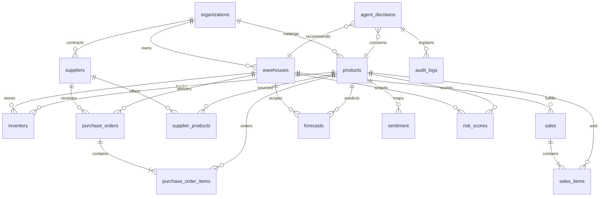

# Database ERD

The existing `database.sql` already contains the core normalized tables and is treated as the starting migration. Phase 1 uses these entities:

## Phase 1 integrity notes

- `inventory` is unique on `(warehouse_id, product_id)` and stores quantity, reservations, incoming quantity, reorder point, safety stock, average daily demand, and derived coverage.
- `forecasts` is unique on `(warehouse_id, product_id, forecast_date)`.
- `purchase_orders` and `purchase_order_items` support approval status and AI provenance.
- `agent_decisions` is the immutable recommendation record; approval/execution is audit logged.
- The draft SQL enables RLS but only defines policies for warehouses, products, and inventory. The hardening migration adds organization-scoped policies for all remaining tables and explicit role checks.
